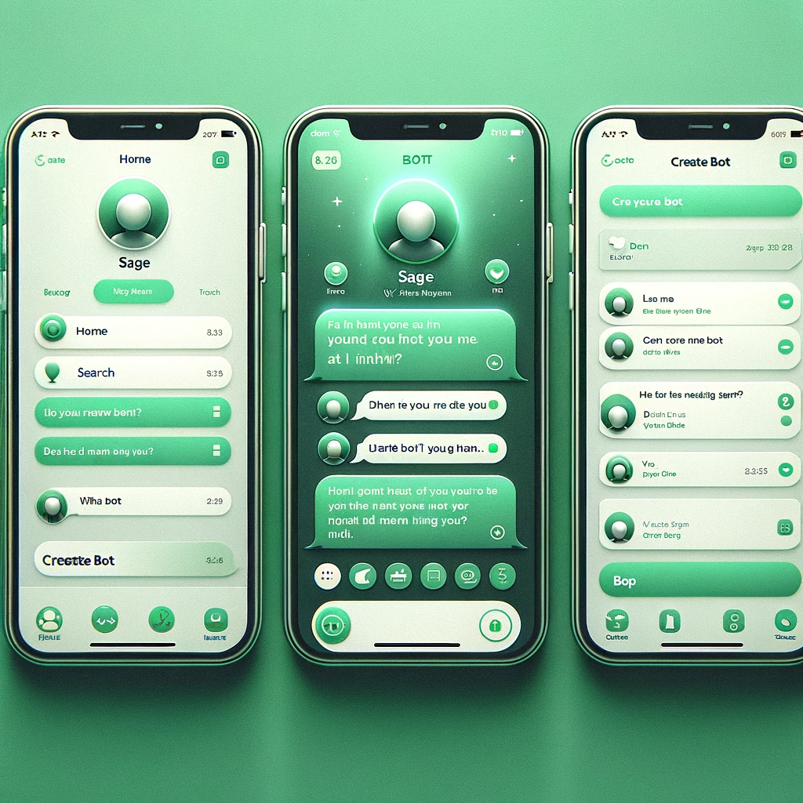

# Sage - Chat with Bots

Welcome to the GitHub repository of Sage, an innovative iOS app where users can chat with a variety of bots and even create their own!



## Features

- **Chat with Bots**: Engage in conversations with a wide range of unique bots.
- **Create Custom Bots**: Use our intuitive interface to create your own chat bots.
- **User-Friendly Interface**: Enjoy a sleek, Apple-like user experience with a green-themed UI.
- **Seamless Navigation**: Easily navigate through the app with our bottom-tab navigation.

## Getting Started

To get started with Sage, clone this repository and open the project in Xcode.

```bash
git clone https://github.com/your-username/sage.git
cd sage
open Sage.xcodeproj
``````

## Requirements

iOS 15.0+
Xcode 13.0+
Swift 5
Installation

Sage uses CocoaPods for managing dependencies. Run the following command to install the required libraries:

